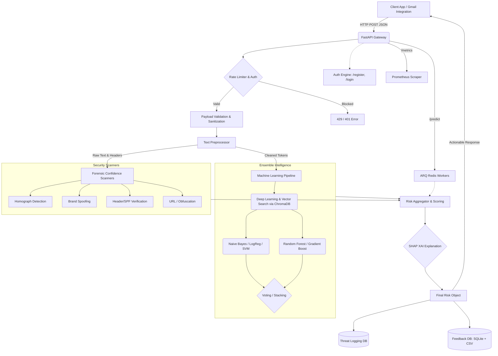

# 🏗️ PhishShield-Engine Architecture

This document provides a high-level overview of the **PhishShield-Engine** system architecture, detailing how the various components—from text preprocessing and forensic scanning to ensemble machine learning and the API gateway—interact to classify and flag threats in real-time.

---

## 🗺️ High-Level System Diagram

At its core, PhishShield-Engine relies on a multi-stage pipeline where an incoming email passes through a **Pre-flight Filter**, a **Forensic Security Scan**, and an **Ensemble ML Inference** engine before a normalized output and explanation are generated.

---

## ⚙️ Core Components Description

### 1. API Interface & Traffic Routing (`src/api/`)

- **FastAPI Framework**: Serves as the high-throughput asynchronous gateway. Exposes a native `/metrics` endpoint for **Prometheus** and Grafana dashboards.
- **Middleware Security**: Intercepts requests to append distinct request IDs (`X-Request-ID`) and implements in-memory, per-IP rate limiting (60 RPM).
- **Background Jobs**: Heavy ML inference and external email integrations are offloaded to **ARQ**, a Redis-based asynchronous task queue, replacing native BackgroundTasks for better scalability.
- **Authentication (`auth.py`)**: Uses Python's built-in `bcrypt` for hashed passwords and `PyJWT` for signed tokens. Authenticated via a central **SQLAlchemy ORM**.

### 2. Preprocessing & Normalization (`src/preprocessing/`)

- **Text Cleaner**: Every raw email is stripped of encoding, normalized to UTF-8 lowercase, and cleaned of extraneous newlines. High-speed **vectorized operations** handle punctuation and stopword removal, providing 20-50x better performance than traditional row-by-row loops.
- **Anonymizer**: All PII (Personally Identifiable Information), including specific names and CC-ed email addresses, is dynamically replaced with regex placeholders before the string hits threat storage.

### 3. Forensic Security Scanning (`src/security/`)

This is the deterministic, rules-based engine that acts adjacent to the ML predictors.

- **Homograph Protection**: Checks string buffers against the Latin, Cyrillic, and Greek unicode pools. Flags if a character looks like a standard Latin `A` but resolves to a Cyrillic character visually hiding a malicious domain.
- **Cyrillic URL Detection**: Explicitly scans extracted URLs for characters in the Cyrillic Unicode block (`[\u0400-\u04FF]`) to catch homograph attacks in raw links.
- **URL & Zero-width Obfuscation**: Scans for embedded zero-width joiners (`\u200D` or `\u200B`) that attackers insert into body text to bypass spam-filters looking for common keywords.
- **Brand Intelligence**: Conducts aggressive fuzzy-matching on specific protected brand lists (e.g., Apple, PayPal). Calculates the Levenshtein distance against known safe domains.

### 4. Machine Learning, Storage, & XAI (`src/models/`, `src/features/`)

- **Storage & Migrations**: A unified **SQLAlchemy** layer manages all database interactions (Users, Feedback, UsageLogs) via `src.core.database`. Schema updates are version-controlled using **Alembic**.
- **Deep Learning & Vector Search**: Introduces `DeepLearningModel` backed by HuggingFace Transformers, alongside semantic similarity threat detection via ChromaDB and SentenceTransformers.
- **Ensemble Structure**: Operates a state-of-the-art `scikit-learn` stack combining MNB, calibrated SVM, Logistic Regression, Random Forest, and Gradient Boosting.
- **XAI via SHAP**: Integrates `shap.LinearExplainer` to extract meaningful feature importance metrics for end-users, explaining exact words that triggered the phishing classifier.
- **Continuous Tuning (`retrain_scheduler.py`)**: A daemon checks the PostgreSQL/SQLite `feedback` table for new records. If a threshold is met, it runs Randomized Search tuning and promotes the best model.

### 5. Config Governance (`config/config.yaml`)

Risk thresholds, model tuning grid-search parameters, security flag weights (including `cyrillic_url: 50`), and compliance retention windows are completely decoupled from runtime code. They are fetched from `config.yaml` using the built-in `config_loader` upon app boot.
