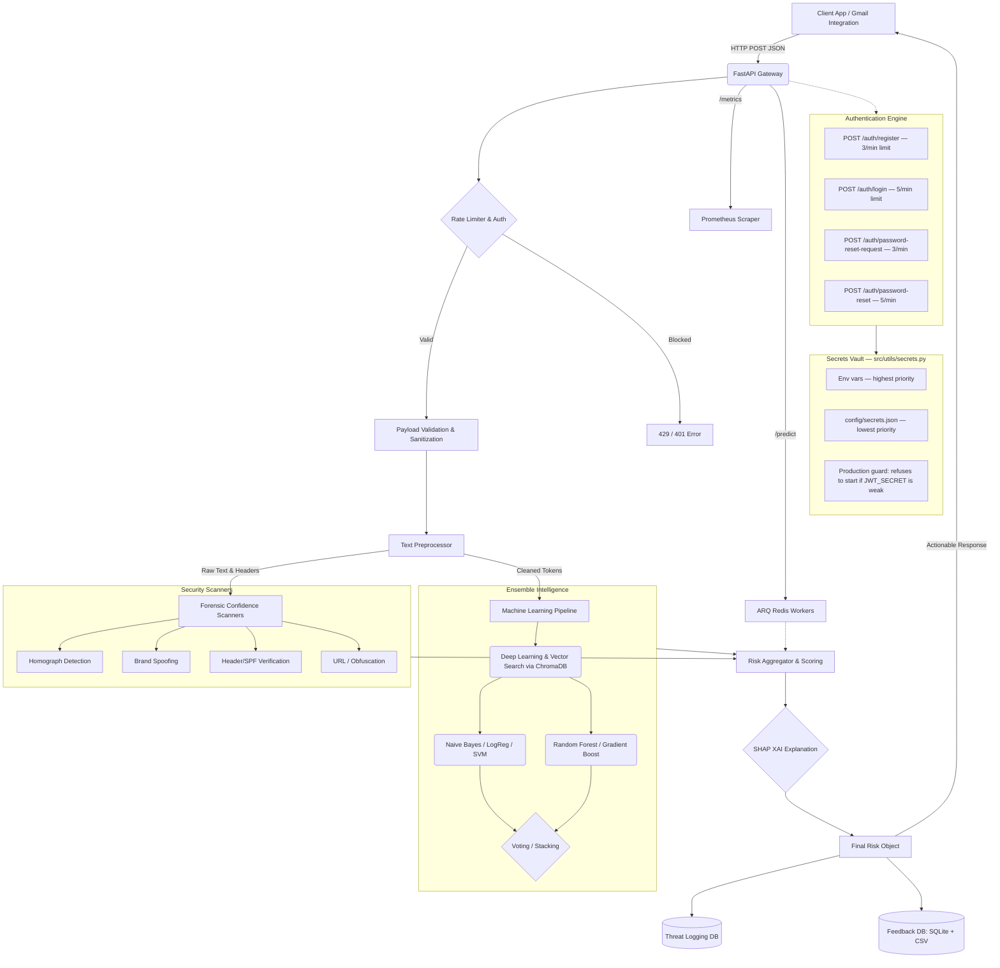

# PhishShield-Engine Architecture

This document provides a high-level overview of the **PhishShield-Engine** system architecture, detailing how the various components—from text preprocessing and forensic scanning to ensemble machine learning and the API gateway—interact to classify and flag threats in real-time.

---

## High-Level System Diagram

At its core, PhishShield-Engine relies on a multi-stage pipeline where an incoming email passes through a **Pre-flight Filter**, a **Forensic Security Scan**, and an **Ensemble ML Inference** engine before a normalized output and explanation are generated.

```mermaid
graph TD
    %% Entry points
    A[Client App / Gmail Integration] -->|HTTP POST JSON| B(FastAPI Gateway)

    %% Security & Auth
    B --> C{Rate Limiter & Auth}
    C -- Valid --> D[Payload Validation & Sanitization]
    C -- Blocked --> E[429 / 401 Error]

    %% Auth Endpoints (hardened)
    subgraph AuthEngine[Authentication Engine]
        B_Reg[POST /auth/register — 3/min limit]
        B_Login[POST /auth/login — 5/min limit]
        B_ResetReq[POST /auth/password-reset-request — 3/min]
        B_Reset[POST /auth/password-reset — 5/min]
    end
    B -.-> AuthEngine

    subgraph SecretsVault[Secrets Vault — src/utils/secrets.py]
        SV1[Env vars — highest priority]
        SV2[config/secrets.json — lowest priority]
        SV3[Production guard: refuses to start if JWT_SECRET is weak]
    end
    AuthEngine --> SecretsVault

    %% Transformation
    D --> F[Text Preprocessor]

    %% Twin pipelines
    F -->|Raw Text & Headers| G[Forensic Confidence Scanners]
    F -->|Cleaned Tokens| H[Machine Learning Pipeline]

    %% Scanners
    subgraph Forensics[Security Scanners]
        G1[Homograph Detection]
        G2[Brand Spoofing]
        G3[Header/SPF Verification]
        G4[URL / Obfuscation]
        G --> G1 & G2 & G3 & G4
    end

    %% ML Engine
    subgraph MachineLearning[Ensemble Intelligence]
        H1(Deep Learning & Vector Search via ChromaDB)
        H2(Naive Bayes / LogReg / SVM)
        H3(Random Forest / Gradient Boost)
        H --> H1
        H1 --> H2 & H3
        H2 & H3 --> H4{Voting / Stacking}
    end

    %% Aggregation
    Forensics --> I[Risk Aggregator & Scoring]
    MachineLearning --> I

    %% Background Jobs & Analytics
    B -- /metrics --> P[Prometheus Scraper]
    B -- /predict --> ARQ[ARQ Redis Workers]
    ARQ -.-> I

    %% Output
    I --> J{"SHAP XAI Explanation"}
    J --> K[Final Risk Object]

    %% Logging & Storage
    K --> L[(Threat Logging DB)]
    K --> FDB[(Feedback DB: SQLite + CSV)]
    K -->|Actionable Response| A
```

---

## Core Components Description

### 1. API Interface & Traffic Routing (`src/api/`)

- **FastAPI Framework**: Serves as the high-throughput asynchronous gateway. Exposes a native `/metrics` endpoint for **Prometheus** and Grafana dashboards.
- **Middleware Security**: Intercepts requests to append distinct request IDs (`X-Request-ID`) and implements in-memory, per-IP global rate limiting (60 RPM) via SlowAPI.
- **Background Jobs**: Heavy ML inference and external email integrations are offloaded to **ARQ**, a Redis-based asynchronous task queue, replacing native BackgroundTasks for better scalability.

### 2. Hardened Authentication System (`src/api/auth.py` + `src/api/routers/auth.py`)

The authentication layer was fully overhauled with production-grade security controls:

| Control | Implementation |
|---------|---------------|
| Password hashing | `bcrypt` with `gensalt()` — auto-selects work factor |
| JWT signing | `PyJWT` HS256 with `sub`, `iat`, `exp`, `jti` claims |
| JWT lifetime | **1 hour** (was 24h) — reduces stolen-token exposure window |
| Secret management | Sourced exclusively from `SecretsVault` — no code-level fallbacks in production |
| Account lockout | 5 bad attempts → 15-minute lockout (configurable) |
| User enumeration prevention | Dummy bcrypt check on unknown usernames — uniform response time |
| API key comparison | `hmac.compare_digest()` — constant-time, prevents timing oracle |
| Password reset | Single-use, SHA-256-hashed, time-limited (1 hour) tokens |
| Per-endpoint rate limits | Login: 5/min · Register: 3/min · Reset: 3/min (per IP) |
| Password policy | 8+ chars + digit + special character |
| Production startup guard | App refuses to start if `JWT_SECRET` is absent or is the dev placeholder |

### 3. Secrets Vault (`src/utils/secrets.py`)

Manages and isolates internal tokens:

- **Priority order** (highest → lowest): OS environment variables → `config/secrets.json`
- `config/secrets.json` is `.gitignored` to prevent token leakage
- In production (`ENV=prod`), raises `RuntimeError` at startup if `JWT_SECRET` is missing or equals the known dev placeholder
- All auth components access secrets via `vault.get("JWT_SECRET")` — the key is never hardcoded

### 4. Database & Migrations (`src/core/database.py` + `alembic/`)

- **Storage & Migrations**: A unified **SQLAlchemy** layer manages all database interactions via `src.core.database`. Schema updates are version-controlled using **Alembic**.
- **Security columns** added to the `users` table (migration `8eb220da558a8768`):
  - `email` — for password reset delivery
  - `is_email_verified` — feature flag for future enforcement
  - `failed_login_attempts` — incremented on bad login, reset on success
  - `locked_until` — lockout expiry timestamp (UTC)
  - `password_reset_token_hash` — SHA-256 hash (raw token never stored)
  - `password_reset_expires` — reset token expiry

### 5. Input Validation, Sanitization & Anti-Bot Layer (`src/utils/sanitizer.py` + `src/api/schemas.py` + `src/api/app.py`)

- **Central Input Sanitizer**: `sanitize_text()` strips null bytes (`\0`), removes non-printable ASCII control characters, HTML-escapes script tags (`<script>`, `<iframe>`), and truncates text payloads.
- **Strict Character Constraints**: `validate_username()` enforces `^[a-zA-Z0-9_-]{3,50}$` to neutralize SQL injection and XSS in username parameters.
- **Bcrypt DoS Protection**: 128-character input limit on all password parameters.
- **Anti-Bot Middleware**: Rejects empty User-Agents on API routes, blocks blacklisted vulnerability scanners (`sqlmap`, `nikto`), and catches bot traps (`bot_trap` field and `X-Honeypot-Trap` header).
- **Security Audit Logger**: Structured event logging (`USER_REGISTERED`, `AUTH_SUCCESS`, `AUTH_FAILURE`, `ACCOUNT_LOCKED`, `BOT_ATTACK_BLOCKED`, `RATE_LIMIT_EXCEEDED`) written to `logs/security_audit.log`.

### 6. Preprocessing & Normalization (`src/preprocessing/`)

- **Text Cleaner**: Every raw email is stripped of encoding, normalized to UTF-8 lowercase, and cleaned of extraneous newlines.
- **Anonymizer**: All PII, including names and email addresses, is replaced with regex placeholders before the string hits threat storage.

### 6. Forensic Security Scanning (`src/security/`)

The deterministic, rules-based engine that acts adjacent to the ML predictors:

- **Homograph Protection**: Checks string buffers against Latin, Cyrillic, and Greek Unicode pools.
- **Cyrillic URL Detection**: Scans extracted URLs for Cyrillic characters (`[\u0400-\u04FF]`).
- **URL & Zero-width Obfuscation**: Scans for embedded zero-width joiners (`\u200D`, `\u200B`).
- **Brand Intelligence**: Fuzzy-matching against protected brand lists using Levenshtein distance.

### 7. Machine Learning, Storage, & XAI (`src/models/`, `src/features/`)

- **Deep Learning & Vector Search**: `DeepLearningModel` backed by HuggingFace Transformers, with ChromaDB semantic similarity.
- **Ensemble Structure**: `scikit-learn` stack combining MNB, calibrated SVM, Logistic Regression, Random Forest, and Gradient Boosting.
- **XAI via SHAP**: Integrates `shap.LinearExplainer` for per-token feature importance.
- **Continuous Tuning**: `retrain_scheduler.py` monitors the feedback table and triggers automated model promotion.

### 8. Config Governance (`config/config.yaml`)

Risk thresholds, model tuning parameters, security flag weights, and compliance retention windows are completely decoupled from runtime code.

---

**Last Updated**: 2026-09-02
