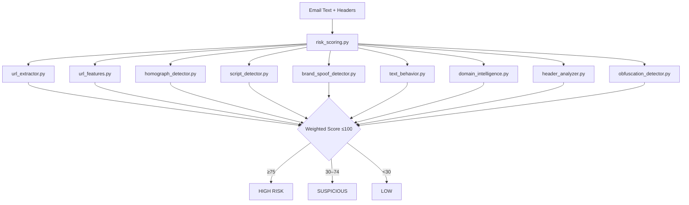
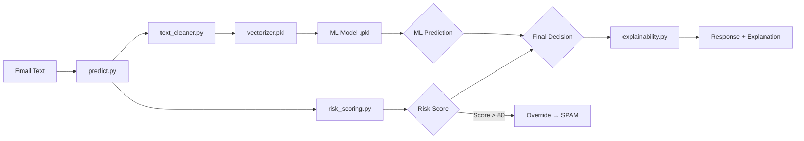
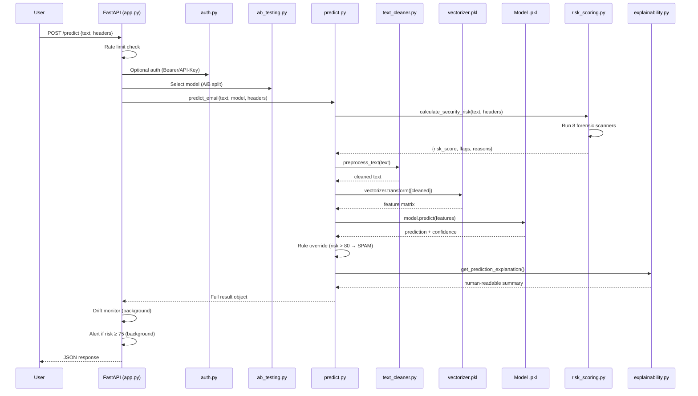
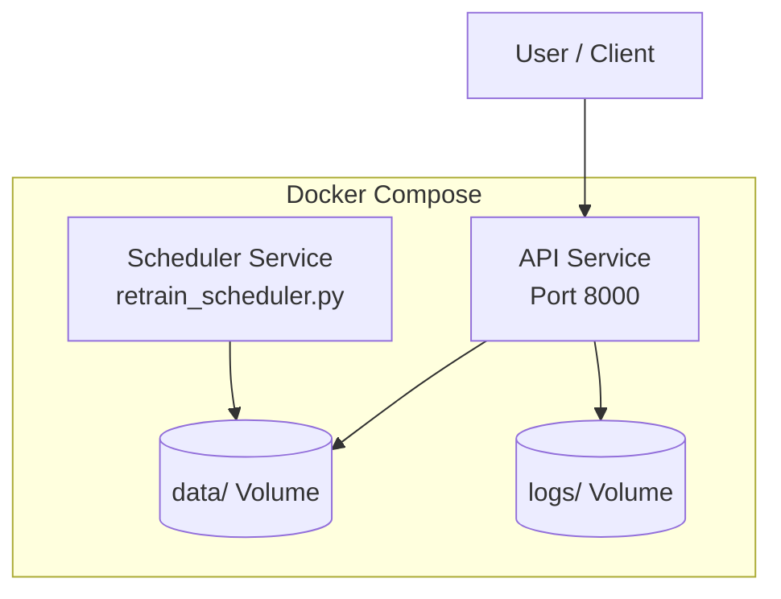

# 🗺️ PhishShield-Engine — Memory Map

> **A comprehensive architectural blueprint of every module, file, and data flow in the project.**

---

## 📦 Top-Level Layout

```
PhishShield-Engine/
│
├── 📂 src/                         # Core application source code
│   ├── 📂 api/                     # REST API & web interface
│   ├── 📂 features/               # Feature extraction & vectorization
│   ├── 📂 integrations/           # Third-party service clients
│   ├── 📂 models/                 # ML inference, training & governance
│   ├── 📂 preprocessing/          # Text cleaning pipeline
│   ├── 📂 security/               # Forensic threat-detection engines
│   └── 📂 utils/                  # Shared utilities & configuration
│
├── 📂 cli/                         # Developer CLI tools
├── 📂 config/                      # Centralized YAML configuration
├── 📂 data/                        # Datasets, databases & threat intel
├── 📂 models/                      # Serialized model artifacts (.pkl)
├── 📂 scripts/                     # Automation & operational scripts
├── 📂 tests/                       # Unit & integration test suite
├── 📂 docs/                        # Documentation
├── 📂 experiments/                 # Experiment tracking logs
├── 📂 logs/                        # Runtime application logs
├── 📂 notebooks/                   # Jupyter notebooks (empty)
│
├── 📄 Dockerfile                   # Container build definition
├── 📄 docker-compose.yml           # Multi-service orchestration
├── 📄 requirements.txt             # Python dependencies
├── 📄 README.md                    # Project overview
├── 📄 .gitignore                   # Git ignore rules
└── 📄 .dockerignore                # Docker ignore rules
```

---

## 🧠 Module Deep Dive

### `src/api/` — REST API & Web Interface

The FastAPI application server. Exposes prediction, security analysis, authentication, and analytics endpoints.

```
src/api/
├── __init__.py
├── app.py                          # Main FastAPI application
│                                   #   ├── POST /predict           → Single email classification
│                                   #   ├── POST /predict/batch     → Batch email classification
│                                   #   ├── POST /analyze-security  → Security-only scan (no ML)
│                                   #   ├── POST /feedback          → User correction submission
│                                   #   ├── GET  /analytics         → Model metrics dashboard
│                                   #   ├── GET  /ab/summary        → A/B test results
│                                   #   ├── POST /auth/register     → User registration
│                                   #   ├── POST /auth/login        → JWT token login
│                                   #   ├── GET  /health            → Liveness probe
│                                   #   ├── GET  /health/ready      → Readiness probe
│                                   #   ├── GET  /                  → Home page (HTML)
│                                   #   └── GET  /dashboard         → Dashboard page (HTML)
│
├── auth.py                         # Authentication module
│                                   #   ├── register_user()         → SQLite user creation + API key
│                                   #   ├── authenticate_user()     → Password verification + JWT
│                                   #   ├── verify_token()          → JWT decode & validation
│                                   #   ├── verify_api_key()        → API key lookup
│                                   #   └── log_usage()             → Access audit trail
│
└── templates/
    ├── index.html                  # Main interactive UI (30 KB, glassmorphic design)
    └── dashboard.html              # Analytics dashboard (8.5 KB)
```

**Key In-Memory State:**
- `ab_test` — A/B testing instance (NB vs SVM, 50/50 split)
- `drift_monitor` — Data drift watcher
- `_rate_store` — Per-IP rate limiter (60 req/60s)

---

### `src/security/` — Forensic Threat Detection Engines

The multi-layer security intelligence system. Each module performs an independent forensic scan, orchestrated by `risk_scoring.py`.

```
src/security/
├── __init__.py
│
├── risk_scoring.py                 # 🎯 ORCHESTRATOR — Calculates 0–100 risk score
│                                   #   ├── calculate_security_risk()  → Runs all 8 scanners
│                                   #   └── run_security_rules()       → Rule-based spam override
│
├── url_extractor.py                # Regex URL extraction from email text
├── url_features.py                 # URL feature analysis (IP URLs, shorteners, TLD checks)
├── url_normalizer.py               # URL canonicalization & normalization
├── homograph_detector.py           # IDN/Punycode homograph attack detection
├── script_detector.py              # Mixed Unicode script detection (Latin/Greek/Cyrillic)
├── brand_spoof_detector.py         # Fuzzy brand impersonation detection (15+ brands)
├── text_behavior.py                # Urgency/reward bait behavioral analysis
├── domain_intelligence.py          # Local SQLite threat intel DB lookup
├── header_analyzer.py              # SPF/DKIM/DMARC & Return-Path validation
├── obfuscation_detector.py         # Zero-width character & hidden marker detection
├── threat_intel.py                 # Threat intelligence DB management
└── alerts.py                       # Security alert dispatcher (triggers on risk ≥ 75)
```

**Data Flow — Security Scan Pipeline:**



---

### `src/models/` — ML Inference, Training & Governance

The machine learning lifecycle — from training to prediction, with A/B testing, drift detection, and explainability.

```
src/models/
├── __init__.py
│
├── predict.py                      # 🎯 INFERENCE ENTRY POINT
│                                   #   ├── predict_email()   → Single prediction + security scan
│                                   #   └── predict_batch()   → Batch classification
│
├── train_models.py                 # Model training (NB, SVM, RF, Decision Tree)
├── ensemble.py                     # VotingClassifier (NB + SVM + RF)
├── evaluate.py                     # Model evaluation & metrics calculation
├── optimized_pipeline.py           # Sklearn Pipeline with optimized preprocessing
│
├── hyperparameter_tuning.py        # GridSearchCV hyperparameter optimization
├── ab_testing.py                   # A/B testing framework (model comparison)
├── drift_monitor.py                # Data/concept drift detection
├── adaptive_learning.py            # Online learning & model warm-starting
│
├── feedback.py                     # User feedback collection (SQLite-backed)
├── explainability.py               # XAI — Human-readable prediction explanations
└── registry.py                     # Model versioning & registry management
```

**Prediction Flow:**



---

### `src/features/` — Feature Extraction

```
src/features/
├── __init__.py
├── vectorizer.py                   # TF-IDF / Bag-of-Words vectorizer wrapper
└── store.py                        # Feature store for processed email features
```

---

### `src/preprocessing/` — Text Cleaning

```
src/preprocessing/
├── __init__.py
└── text_cleaner.py                 # Text normalization, stopword removal, stemming
```

---

### `src/integrations/` — External Service Clients

```
src/integrations/
└── gmail_client.py                 # Google OAuth2 Gmail API integration
                                    # Automated inbox scanning & threat response
```

---

### `src/utils/` — Shared Utilities

```
src/utils/
├── __init__.py
├── config_loader.py                # YAML config reader (loads config/config.yaml)
├── data_loader.py                  # Dataset loading, cleaning & synthetic generation
├── data_versioning.py              # Dataset snapshot & rollback (data/versions/)
├── logger.py                       # Centralized logging (request IDs, app.log)
├── anonymizer.py                   # PII redaction for GDPR compliance
└── compliance.py                   # Data retention policies & audit logging
```

---

## 🔧 CLI & Scripts

### `cli/` — Developer Management Tool

```
cli/
└── manage.py                       # CLI entry point
                                    #   ├── serve     → Launch FastAPI server
                                    #   ├── block     → Add domain to threat blocklist
                                    #   └── metrics   → Show system health stats
```

### `scripts/` — Automation & Operations

```
scripts/
├── train_pipeline.py               # End-to-end ML training pipeline
│                                   #   Flags: --generate, --n_samples, --tune, --ensemble
├── retrain_scheduler.py            # Background daemon — auto-retrain on feedback threshold
├── chaos_monkey.py                 # Fault injection (model corruption, load spikes)
└── backup.py                       # Timestamped snapshot of models, DBs & configs
```

---

## 💾 Data & Persistence

### `data/` — Datasets & Databases

```
data/
├── raw/
│   └── emails.csv                  # Raw training dataset (70 KB)
├── processed/
│   └── preprocessed.csv            # Cleaned & normalized dataset (45 KB)
├── versions/
│   ├── metadata.json               # Versioning metadata
│   └── run_*_emails.csv            # Timestamped dataset snapshots
│
├── auth.db                         # SQLite — User credentials & API keys
├── threat_intel.db                 # SQLite — Domain blocklist & threat intel
└── security_alerts.log             # Security alert history
```

### `models/` — Trained Artifacts

```
models/
├── naive_bayes.pkl                 # Naive Bayes classifier
├── svm.pkl                         # Support Vector Machine classifier
├── decision_tree.pkl               # Decision Tree classifier
├── ensemble_model.pkl              # VotingClassifier (NB + SVM + RF)
├── vectorizer.pkl                  # TF-IDF/BoW vectorizer
├── metrics.json                    # Current model performance metrics
└── registry/
    └── registry.json               # Model version registry & metadata
```

---

## ⚙️ Configuration

### `config/config.yaml` — Governance-as-Code

```yaml
security:
  weights:                          # Risk score contribution per threat type
    homograph: 40                   # IDN attack weight
    brand_spoof: 45                 # Brand impersonation weight
    domain_blacklist: 60            # Known malicious domain weight
    header_spoof: 40                # Header spoofing weight
    ...
  thresholds:
    high_risk: 75                   # Score ≥ 75 → HIGH RISK
    suspicious: 30                  # Score ≥ 30 → SUSPICIOUS

models:
  default: "naive_bayes"            # Fallback model
  registry: "models/registry.json"  # Model registry path

api:
  rate_limit: 10                    # Requests per window
  max_text_length: 5000             # Max email length (chars)
  port: 8000                        # API server port

compliance:
  retention_days: 30                # Auto-delete after 30 days
  log_path: "logs/compliance.log"   # Audit log location
```

---

## 🧪 Testing

```
tests/
├── __init__.py
├── test_api.py                     # API endpoint integration tests
├── test_model.py                   # ML model prediction tests
├── test_preprocessing.py           # Text cleaner unit tests
└── test_vectorizer.py              # Vectorizer transform tests
```

**Run:** `python -m pytest tests/`

---

## 🔄 End-to-End Request Flow



---

## 🐳 Docker Architecture



---

## 📊 Key Database Schema

| Database | Engine | Purpose | Location |
|:---------|:-------|:--------|:---------|
| `auth.db` | SQLite | User accounts, API keys, usage logs | `data/auth.db` |
| `threat_intel.db` | SQLite | Domain blocklist, threat intel records | `data/threat_intel.db` |
| `feedback` | SQLite | User prediction corrections | Managed by `src/models/feedback.py` |

---

## 👨‍💻 Maintainer

**VIPHACKER100 (Aryan Ahirwar)**
*Cybersecurity Researcher | AI Security Lead*
